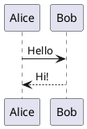
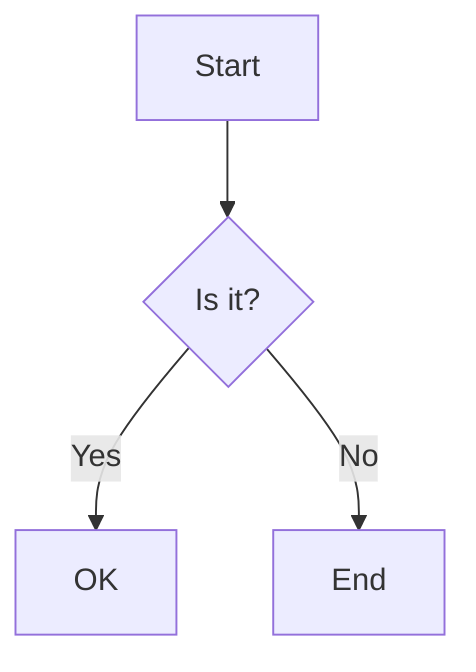

# Test de conversion

## Code avec syntax highlighting

```python
def hello_world():
    print("Hello, world!")
```


```puml
@startuml
Alice -> Bob: Hello
Bob --> Alice: Hi!
@enduml
```


```mermaid
graph TD
    A[Start] --> B{Is it?}
    B -->|Yes| C[OK]
    B -->|No| D[End]
```

